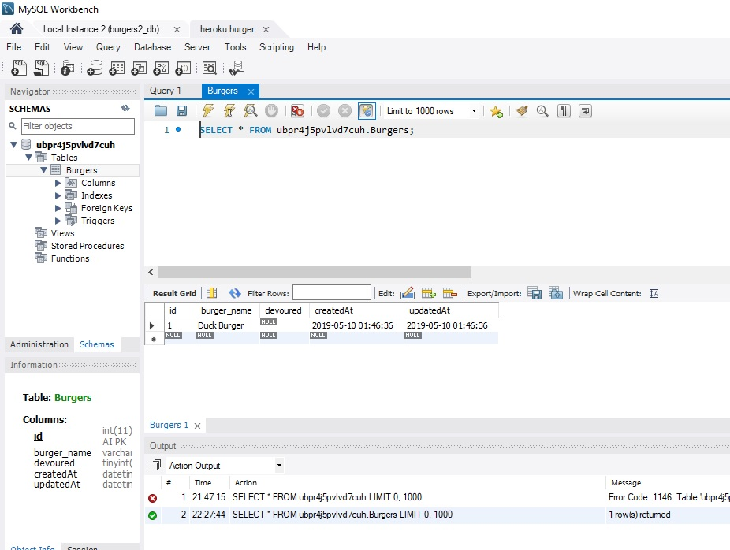
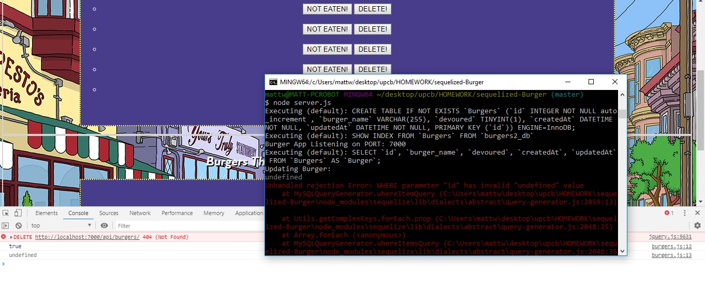

# sequelized-Eat-Da-Burger

In this project, we were asked to sequelize our Eat-Da-Burger app that was previously created with ORM.  Completing this aspect of the project turned out to be slightly more difficult than the activities we've done in class, mainly because going from numerous files in the ORM way, to the more simplified sequelize version, I think I either over-edited the files, or just have a small typo somewhere.

The app is successfully hosted on heroku with a JawsDB add-on, as well as gitHub, however, my database burger_names would not show up, and the PUT and DELETE calls were not able to get the correct Id for some reason.  Screenshots will also be provided below, and I will try to restart the conversion to sequelize after this group project.

Also submitted was the ORM version of eat-da-burger, which is working properly and hosted on heroku.

